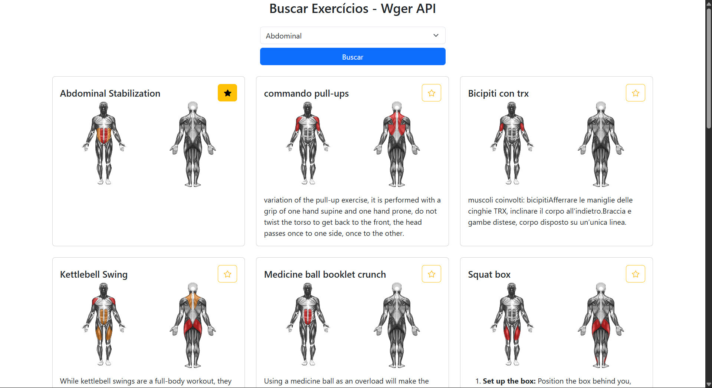

# Projeto: desenvolvimento de aplicação com API web pública

Imagens do **site criado**:  

Acesso: 

#### Desenvolvedor
Álisson Braga Canabarro, Ciência da Computação

##### Descrição

É um site de listagem de exercícios, que faz uso da API Wger.
Possui um dropdown para filtrar os exercícios por categoria. Os exercícios são listados em cards, com descrição, imagem dos músculos trabalhados e um botão para favoritar o exercício.
Foi adicionado um limite de 12 exercícios por página com botões para navegação entre elas.
Faz uso de localStorage para guardar o ID dos exercícios favoritados.

#### Desenvolvimento
Comecei usando como base o [Projeto2a](https://github.com/elc1090/project2a-2025a-meunomeali), que realiza requisições para a API do GitHub e cria cards formatados com as respostas (o Projeto2a, por sua vez, utilizou [este tutorial](https://codesnippet.io/github-api-tutorial/) como referência).
Depois de entender como utilizar a API Wger, criei os cards com os dados que eu queria, nome e descrição do exercicio.
Com os cards prontos, foquei em adicionar um botão de favoritar, que faz uso do localStorage. Como sei que o localStorage tem armazenamento pequeno, eu apenas armazeno o ID dos exercicios, já que a API permite pesquisa por ID.
Para atender todos os requisitos da atividade, eu precisava adicionar imagens, mas percebi que a maioria dos exercicios não possuí imagem. Assim decidi usar como imagem os músculos trabalhados em cada exercicio, pois a maioria dos exercicios possuí uma lista de músculos, e a API tem imagens desses músculos.

#### Tecnologias

- HTML
- Javascript
- Bootstrap

#### Ambiente de desenvolvimento

VS Code com as extensões:
- HTML CSS Support

#### Referências e créditos

Botão favoritar:
https://vidafullstack.com.br/css/como-criar-um-botao-de-like-com-css-e-js/

Favoritos localStorage:
https://stackoverflow.com/questions/64830358/making-an-add-to-favorites-button-with-javascript

Chat GPT, exemplo resumido de prompt:
- Como passar vários IDs de exercicios para a API retornar suas descrições ? (exercicios favoritados)
- Como adicionar imagens de uma url assim: "https://wger.de/static/muscles/muscular_system_front.svg" ?

---
Projeto entregue para a disciplina de [Desenvolvimento de Software para a Web](http://github.com/andreainfufsm/elc1090-2025a) em 2025a
